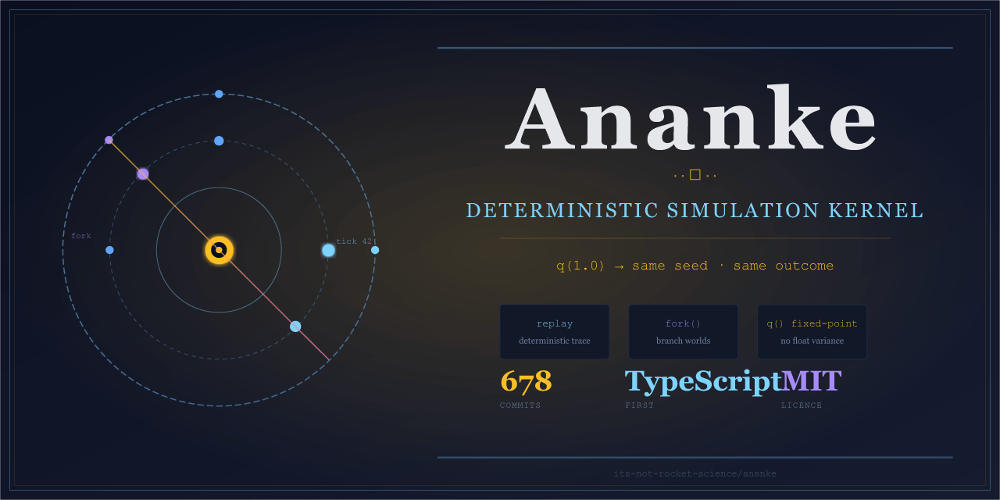

# Ananke


-brightgreen)


> Package: `@its-not-rocket-science/ananke`  
> Stable API contract: [`STABLE_API.md`](STABLE_API.md)  
> Status: active engineering project; stable root API, exploratory submodules

Ananke is a deterministic simulation kernel for host applications.

It is designed for projects that need a world state to evolve reproducibly while leaving rendering, persistence, networking, content authoring, and deployment under the control of the host application.

## Core contract

Given the same:

- initial world state,
- command stream,
- tick count, and
- engine version,

Ananke should produce the same outcome.

That makes it useful for replay, debugging, deterministic tests, lockstep-style simulation, audit trails, and host-controlled narrative or game systems.

## Use Ananke when

- you need a reproducible simulation loop;
- you want host-owned rendering and persistence;
- you need deterministic fixtures for tests or replays;
- you want a stable root import surface for long-lived integrations;
- you are comfortable treating advanced subpath modules as version-pinned or experimental.

## Do not use Ananke if

- you want a complete game engine;
- you need a visual editor;
- you want turnkey networking;
- you need a no-code simulation builder;
- you expect every exported internal module to be semver-stable.

## 10-minute success path

```bash
npm install
npm run build
npm run example:first-hour
npm run test:first-hour-smoke
```

Then follow the first-hour adopter path:

```text
docs/first-hour-adopter-path.md
```

## Minimal deterministic loop

```ts
import {
  createWorld,
  q,
  stepWorld,
  type CommandMap,
} from "@its-not-rocket-science/ananke";

const world = createWorld(1337, [
  {
    id: 1,
    teamId: 1,
    seed: 10,
    archetype: "KNIGHT_INFANTRY",
    weaponId: "wpn_longsword",
    armourId: "arm_mail",
    x_m: -1.2,
  },
  {
    id: 2,
    teamId: 2,
    seed: 11,
    archetype: "HUMAN_BASE",
    weaponId: "wpn_club",
    x_m: 1.2,
  },
]);

const commands: CommandMap = new Map([
  [1, [{ kind: "attackNearest", mode: "strike", intensity: q(1.0) }]],
  [2, [{ kind: "attackNearest", mode: "strike", intensity: q(1.0) }]],
]);

stepWorld(world, commands, { tractionCoeff: q(0.9) });
```

## Stable API promise

For semver stability, import from the package root only:

```ts
import {
  createWorld,
  stepWorld,
  q,
  type CommandMap,
} from "@its-not-rocket-science/ananke";
```

Tier-1 root exports are documented in:

- [`STABLE_API.md`](STABLE_API.md)
- [`docs/public-contract.md`](docs/public-contract.md)
- [`docs/stable-api-manifest.json`](docs/stable-api-manifest.json)

Subpath modules are shipped and supported, but are not part of the Tier-1 semver contract unless explicitly called out as stable.

## What is stable today

Stable today means Tier-1 root exports from `@its-not-rocket-science/ananke`:

- fixed-point primitives and helpers (`q`, `SCALE`, related conversion and maths utilities);
- host-facing types (`Entity`, `WorldState`, `Command`, `CommandMap`, `KernelContext`);
- deterministic world and scenario entry points (`createWorld`, `loadScenario`, `validateScenario`);
- deterministic stepping (`stepWorld`);
- replay helpers (`ReplayRecorder`, `replayTo`, `serializeReplay`, `deserializeReplay`);
- bridge snapshot extraction (`extractRigSnapshots`, `deriveAnimationHints`).

If you need long-term compatibility, keep production integrations on this root Tier-1 surface.

## What is shipped but not semver-stable

These surfaces are available, but outside the Tier-1 stability promise unless separately documented:

- most subpath modules in `package.json#exports`, including `./combat`, `./character`, `./tier2`, `./tier3`, `./netcode`, and `./host-loop`;
- emerging or advanced modules that may change shape between minor releases;
- exploratory integration helpers and higher-order systems.

Treat these areas as adopt-with-version-pinning.

## Useful next files

- [`docs/PROJECT_STATUS.md`](docs/PROJECT_STATUS.md) — plain-English status for visitors
- [`docs/host-contract.md`](docs/host-contract.md) — host integration contract
- [`docs/bridge-contract.md`](docs/bridge-contract.md) — renderer bridge contract
- [`docs/support-boundaries.md`](docs/support-boundaries.md) — maintainer commitments and support boundaries
- [`docs/engineering-guarantees.md`](docs/engineering-guarantees.md) — explicit engineering guarantees

## Boundaries note

First-hour checks verify setup and basic deterministic behaviour. They do not validate your production integration. Host applications should keep their own regression suite and pin versions where deterministic behaviour is part of their product contract.
